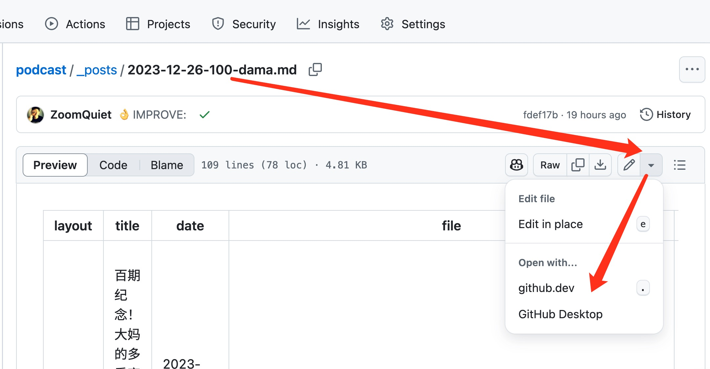
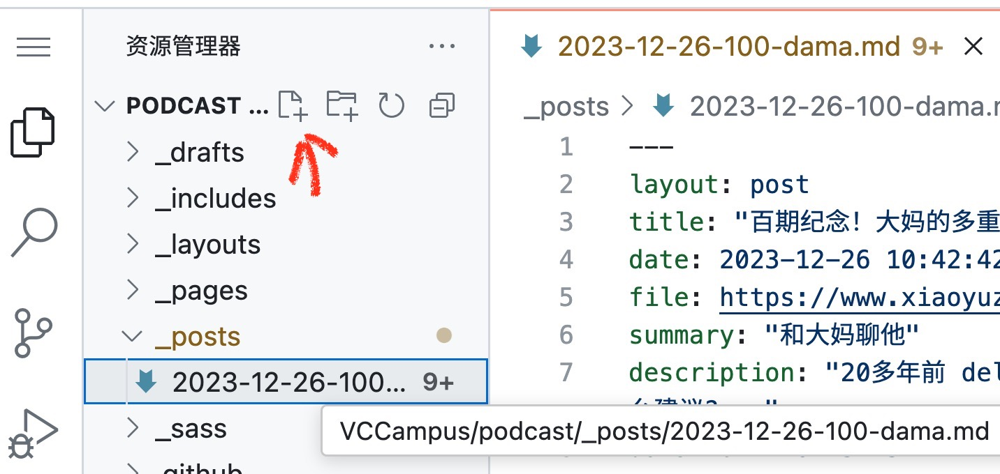

# podcast
> CRYPTO STARTUP SCHOOL

## background
小宇宙节目, 值得有独立网站发布

## goal
日常通过 github 即可完成所有内容发布任务

- 将 CSS 过往节目整理为网页文章, 并追加 Ai 智能分析
- 将收听链接指向原始 小宇宙节目

## logging
> 日常使用说明:

整体原则:

- 登录 github 
- 进入当前仓库, 创建文章, 提交
- 其它一切自动完成

具体使用:

- 登录 github, 并确保已经拥有仓库的管理权限
    + 将自己的github 帐号, 类似: https://github.com/ZoomQuiet 这种链接
    + 提供给管理员, 进行邀请
    + 然后, 在 https://github.com/VCCampus 应该可以看到浮动警示信息(也可以通过邮箱信息的链接接受邀请)
    + 点击接受邀请,
    + 然后, 可以进入 [VCCampus/podcast/settings](https://github.com/VCCampus/podcast/settings) 配置后台, 说明权限已经绑定好
- 进入: https://github.com/VCCampus/podcast/tree/main/_posts
    + 这是日常文章目录
    + 其它目录是样式以及配置等等, 日常内容维护时, 不用理会
- 进入编辑界面:
    + 点击任何一个 .md 文件
    + 进入后, 键盘输入 `.` 也就是英文的句号
    + 也可以通过右上角的小铅笔编辑按钮进入菜单, 选择 `github.dev`
    + 
- 创建或是修改对应 .md 文件
    + `github.dev` 其实就是一个云端版本的 [Visual Studio Code](https://code.visualstudio.com/) 拥有所有编辑器的功能
    + 可以在左侧文件树顶部的 `创建文件` 按钮
    + 
    + 然后, 按照即有的文章格式编辑节目内容
- 约定, 主要是头部的 meta 部分是固定格式要注意:
    + 前后的 `---` 是标识分隔符不要动
    + title: 是节目标题, 可以复用 CSS 中的
    + date: 是文章发布时间, 当前可以使用 CSS 节目发布时间, 即可以写过去的时间
    + file: 原先指节目录音文件地址, 现在应该写 小宇宙 中的节目链接
    + summary: 即节目概要
    + description: 节目主要内容, 这是 RSS 显示内容, 可以委托 AI 自动总结正文或是, 录音内容生成
    + duration: 节目时长, hh:mm:ss 格式
    + length: 节目总秒数, 得将 duration 的小时分钟统一为秒
    + explicit, block 是样式插件依赖的参数, 不用变动
    + keywords: 可以理解为 标签, 根据节目内容, 标定3~4个关键词即可
    + voices: 也就是列席人员, 节目中声音出现的人员, 都可以列上
    + 正文部分, 以 `### ` 开始, 只是标准的 markdown 格式文本, 将节目相关信息汇集即可..
- 提交, 也就是 git 的 push 操作
    + 在 `github.dev` 中很简单,
    + 点击最左侧第三个图标, 进入 git 工具
    + 一般都能自动检验到哪些文件进行了修订
    + 只要在消息中填写当前的操作注释, 比如: "发布新节目" "修订节目内容" ..
    + 点击绿色的 `提交并推送` 按钮即可
- 检验: https://github.com/VCCampus/podcast/actions
    + 进入 Actions
    + 就可以看到刚刚提交的内容, 进行触发了 `workflow`
    + 而且, 对应注释就是刚刚提交时填写的
    + 当对应操作完成, 出现 `绿色对号` 图标时, 说明当前网站已经完成新近, 将最新内容重新编译发布了
    + 这时就可以刷新网站确认是否已经上线, 已经编辑效果

### TODO
> 未尽任务

- 当前是 github-pages 提供的临时域名, 需要配置为指定的长期域名
- 当前根据 [fm\.101\.camp](https://fm.101.camp/) 快速修订而来, 有很多内容并不匹配 CSS , 需要持续发现, 并修订
- 如果每篇文章, 都有相同的内容, 可以配置一个通用 `缀文` 安装到文章模板中, 节省每次的编辑时间

## refer.

- [配置 GitHub Pages 站点的自定义域 - GitHub 文档](https://docs.github.com/zh/pages/configuring-a-custom-domain-for-your-github-pages-site/troubleshooting-custom-domains-and-github-pages)
- ...

## tracing

- 250508 DAMA init.

